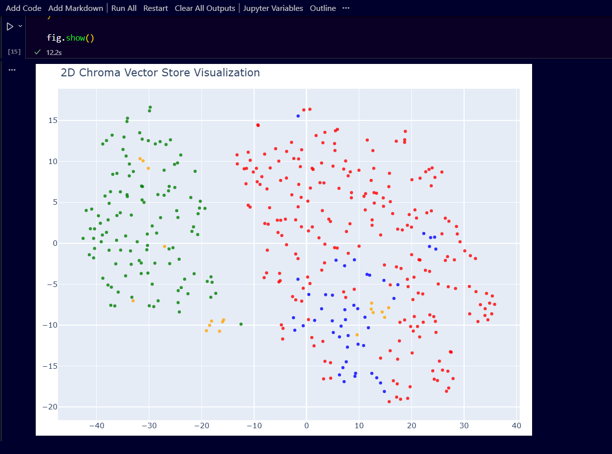
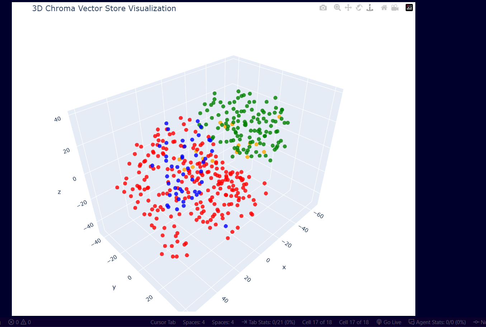
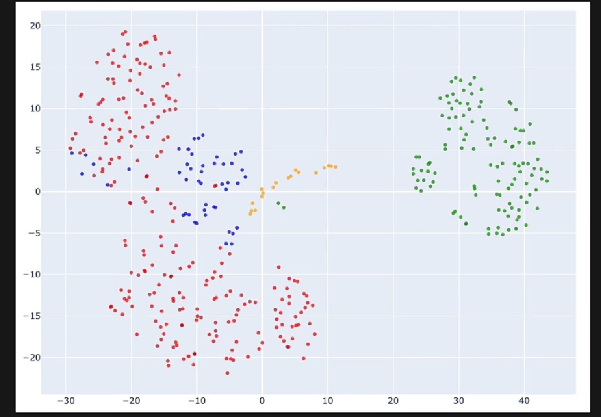
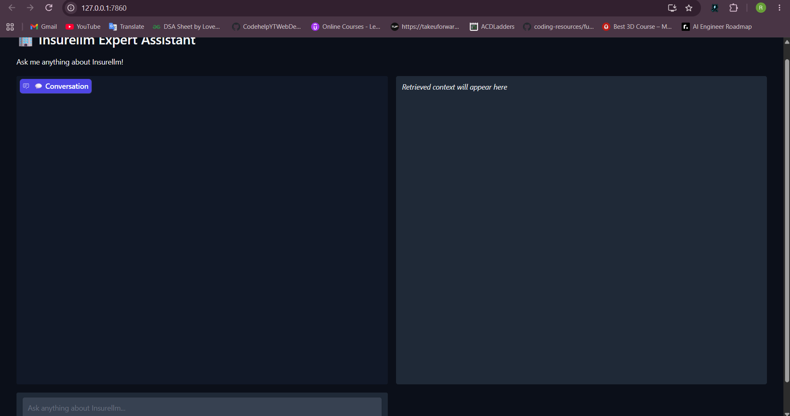
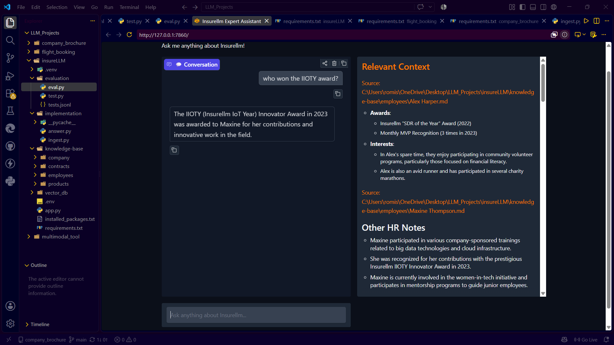
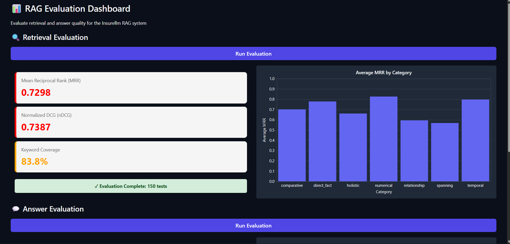
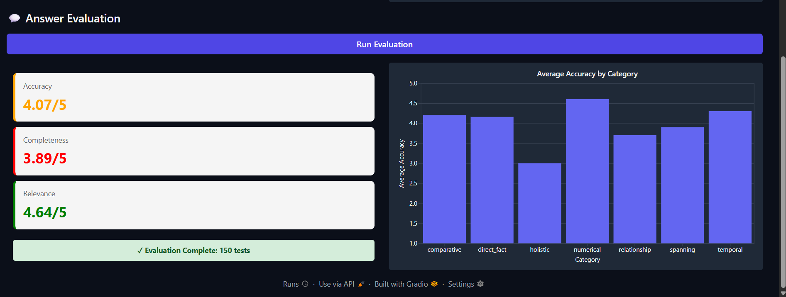
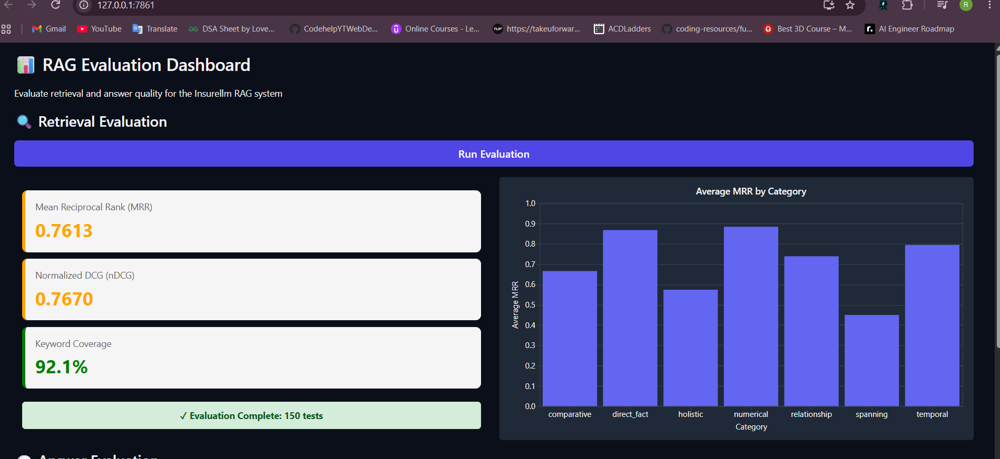
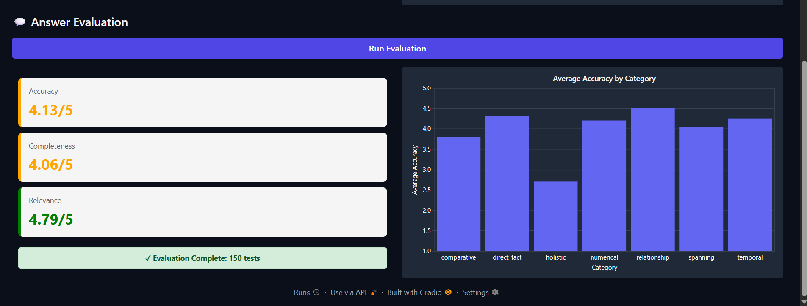

# 🧠 InsureLLM — RAG-Based AI Knowledge Worker

> **Build an AI knowledge worker using RAG to become an expert on all company-related matters.**

InsureLLM is a **Retrieval-Augmented Generation (RAG)** project built using **LangChain, Hugging Face, ChromaDB, and Gradio**. It converts company documents into searchable vectors and uses retrieval to provide context-aware answers.

---

## RAG Pipeline

```text
Documents
    ↓
Chunking
    ↓
Embeddings
    ↓
Chroma Vector Database
    ↓
User Question
    ↓
Question Embedding
    ↓
Vector Search
    ↓
Relevant Chunks
    ↓
Frontier LLM
    ↓
Answer
```

---

## 🛠️ Tech Stack

- **LangChain** — RAG pipeline
- **Hugging Face** — Embedding model
- **all-MiniLM-L6-v2** — Text embeddings
- **ChromaDB** — Free, open-source vector database
- **Frontier LLM** — (OpenAI)Answer generation
- **Gradio** — Web UI
- **t-SNE** — 2D/3D vector visualization
- **Python** — Implementation

---

## 📚 Knowledge Base & Embeddings

Company-related documents are:

1. Loaded from the knowledge base
2. Split into smaller chunks
3. Converted into embeddings using `all-MiniLM-L6-v2`
4. Stored in ChromaDB

The knowledge base produces **413 chunks**.

### 📊 Vector Visualization

**2D t-SNE**



**3D t-SNE**



**2D t-SNE (openAI- text-embedding-3-small)**



---

## 🤖 RAG Question Answering

LangChain is used to connect the retriever and LLM.

When a question is asked:

```text
Question
   ↓
Embedding
   ↓
Chroma Vector Search
   ↓
Relevant Context
   ↓
LLM
   ↓
Answer + Sources
```

The Gradio application provides an interface for interacting with the RAG system.

### 💻 Gradio UI

> 📷 Add application screenshot here




---

# 🧪 RAG Evaluation

The RAG system is evaluated using a **Golden Dataset** containing curated questions, reference answers, and expected keywords.

Example:

| Question | Expected Keywords |
|---|---|
| Who won the prestigious IOTY award? | Maxine, Thompson |

### Retrieval Metrics

- **MRR**
- **NDCG**
- **Recall**
- **Precision**
- **Keyword Coverage**

### Answer Evaluation

A strong LLM is used as a judge to evaluate:

- **Accuracy**
- **Completeness**
- **Relevance**

---

# 📊 Evaluation Experiments

Three experiments were performed by changing the **number of workers** and **chunking size**.

## Experiment 1

**Workers:** `5`  
**Chunk Size:** `1000`

### Results





---

## Experiment 2

**Workers:** `10`  
**Chunk Size:** `500`

### Results

|





---


---

##  Run

```bash
pip install -r requirements.txt
python implementation/ingest.py
python app.py
```

---

##  Key Takeaway

InsureLLM demonstrates a complete **RAG workflow**:

**Documents → Chunks → Embeddings → ChromaDB → Retrieval → Frontier LLM → Answer → Evaluation**

with experiments measuring how **chunk size and worker configuration affect RAG retrieval and answer quality**.